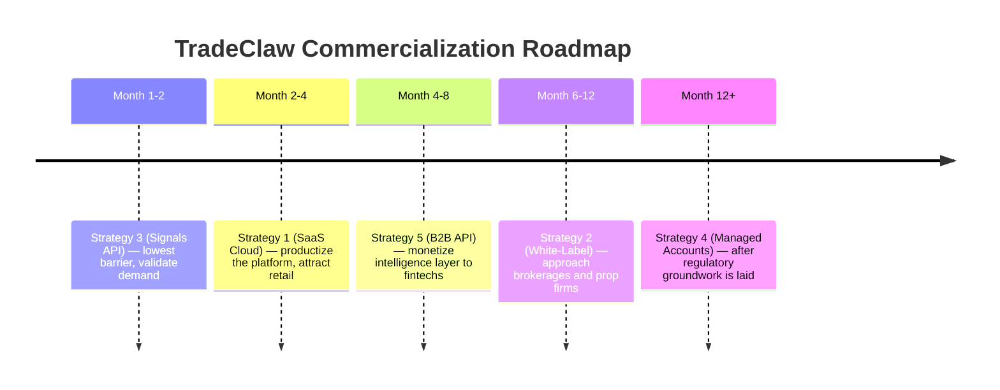

# TradeClaw — Commercialization Strategy

> **Platform Summary**: TradeClaw is an AI-powered, multi-agent algorithmic trading system built on a stack of Bollinger Band mean-reversion, Fibonacci retracement, ADX regime detection, VWAP analysis, Kelly Criterion position sizing, and a self-evolving AI Brain (Gemini/Ollama). Six specialised sub-agents deliberate via a quorum protocol before every order. A "Vital Signs" organism model governs survival states and dynamically escalates LLM model tier as profitability grows. The frontend is a real-time Next.js dashboard (the "Situation Room") backed by Firebase/Firestore and an MetaTrader 5 brokerage integration.

---

## The Core IP Protection Principle

> [!CAUTION]
> **This is the non-negotiable constraint across every strategy below.**  
> Your API credentials — MetaTrader 5 keys, Gemini/OpenClaw tokens, Firebase service accounts — **must never leave your infrastructure**. Users should interact only with outputs and controls that your backend exposes, not with the raw credential layer.

The key architectural principle is **server-side credential isolation**:

- All calls to MetaTrader 5, Gemini, OpenClaw, Ollama, and Firebase are made **from your backend**, never from the client.
- Users bring their **own MetaTrader 5 brokerage credentials** (which you store encrypted server-side) — you never commingle their broker credentials with yours.
- Your **AI inference layer** (Gemini/OpenClaw/Ollama) remains invisible to all users. It is a cost-of-goods-sold, not a user-facing service.
- Your **Firebase project** is never client-accessible; only your Python backend has the service account key.

---

## Strategy 1: SaaS Subscription — "TradeClaw Cloud" ☁️

### The Concept

Deploy TradeClaw as a **fully managed, multi-tenant cloud platform**. Users sign up, connect their own MetaTrader 5 brokerage account (paper or live), configure their bot fleet through the existing Situation Room UI, and pay a monthly subscription. Your infrastructure runs all the AI, all the signals, and all the execution — they never see a key or a model.

### How It Works Technically

```
User (Browser) → TradeClaw SaaS Frontend (Next.js on Vercel/Cloud Run)
                          ↓
              TradeClaw API (FastAPI — YOUR infrastructure)
            /          |           \           \
    User's MetaTrader 5   YOUR Gemini   YOUR Ollama   YOUR Firebase
    (their keys,    (your API     (your          (your service
     stored AES-    key, never    server,        account,
     encrypted in   exposed)      not theirs)    not theirs)
     YOUR DB)
```

**Key Technical Steps:**

1. **Multi-tenant bot isolation**: Each user's bot instance runs in an isolated `BotEngine` context. Their MetaTrader 5 API key is stored AES-256 encrypted in your database and decrypted only server-side at order execution time. It is never returned to the browser.
2. **Your AI keys stay server-side**: The `OPENCLAW_TOKEN`, `GEMINI_API_KEY`, and Ollama endpoint are environment variables on your Cloud Run / VM. They are consumed by the `StrategyEvolver` and `SubAgentPool` purely in-process. No user-facing endpoint exposes them.
3. **Your Firebase stays private**: The `service-account-key.json` never leaves your backend. All Firestore reads/writes (trades, AI decisions, telemetry) flow through your Python server; the frontend polls your REST API, not Firestore directly.
4. **Rate limiting per plan**: Use a middleware layer (Redis + token bucket) to enforce per-user bot count, polling frequency, and AI Brain evolution cycle limits based on subscription tier.

### Pricing Model

| Tier | Price / Month | Bots | Symbols | AI Brain | Sub-Agents |
|---|---|---|---|---|---|
| **Claw Starter** | $49 | 1 bot | 1 symbol | Scheduled (hourly) | Technical + Watchman only |
| **Claw Pro** | $149 | 5 bots | 5 symbols | Event-triggered + Scheduled | All 6 agents |
| **Claw Elite** | $399 | 20 bots | 20 symbols | Real-time LOSS_STREAK trigger | All 6 agents + Apex tier unlock |
| **Hedge Fund** | Custom | Unlimited | Unlimited | Dedicated compute | White-glove onboarding |

### Why It Protects Your IP

- The entire `ai_brain.py`, `sub_agents.py`, `strategy.py`, `regime_detector.py` stack runs in **your** container, not theirs.
- Users receive *signals and executed trades*, not the code or credentials that produce them.
- Your MetaTrader 5 paper/live account is **never used** for user trades — they bring their own broker relationship.

---

## Strategy 2: White-Label Licensing — "TradeClaw Engine" 🏢

### The Concept

License TradeClaw as a **turn-key algorithmic trading engine** to fintech companies, prop trading firms, or retail brokerages that want to offer AI-driven automated trading to their clients under their own brand. You sell the platform, not just access to it.

### Two License Tiers

**Tier A — Managed License ($2,500–$5,000/month)**
- You host TradeClaw on dedicated infrastructure for the licensee.
- They white-label the Situation Room UI (their logo, their domain).
- Your API keys and AI infrastructure stay on your servers.
- They pay you per-seat, per-bot-execution, or flat fee.
- You push updates; they never see the source.

**Tier B — Perpetual + Escrow ($50k–$200k one-time + annual support)**
- Full source code sold, but with **Software Escrow** holding the keys.
- The purchaser gets the codebase but must sign an IP agreement preventing resale.
- Your Gemini/OpenClaw credentials are **not included** — they must acquire their own LLM contracts. You charge for integration consulting.
- This is for institutional buyers with compliance requirements around self-hosting.

### How It Protects Your IP (Managed License)

Under the Managed License model, the licensee's users never interact with your raw infrastructure:

```
Licensee's Users → Licensee's White-Labeled UI
                          ↓
              YOUR TradeClaw Backend (dedicated tenant)
            /
    Licensee's MetaTrader 5 Enterprise Agreement
    (their broker keys, their account, your engine)
```

- You provision a **dedicated tenant namespace** in your infrastructure for the licensee
- They never get SSH access, API tokens, or database credentials
- You use Docker image delivery or private Git submodules — never raw source
- A **license server** (e.g., Keygen.io or custom JWT) validates that the running instance is authorised

### Revenue Model

```
Managed License:  $3,000/month base + $50/active bot/month
Perpetual:        $100,000 one-time + $15,000/year support
Custom enterprise: negotiated over trading volume share (0.05%–0.20% AUM)
```

> [!IMPORTANT]
> For Tier B, always use **source code obfuscation** (PyArmor for Python) before delivery, and contractually prohibit the buyer from using the AI inference keys from your environment in their deployment. Require them to sign an IP licensing agreement.

---

## Strategy 3: Signals-as-a-Service — "TradeClaw Pulse" 📡

### The Concept

Instead of selling bot execution, sell only the **intelligence layer** — the signals generated by TradeClaw's regime detector, Fibonacci engine, VWAP analyser, momentum filter, and multi-agent deliberation system. Users receive clean, structured JSON trade signals via webhook or REST API, and they execute however they choose (their own broker, their own scripts, TradingView alerts, etc.).

This is a **much lower regulatory footprint** than full execution and dramatically broadens the addressable market.

### What You Deliver

Your system produces — and you publish — structured signal payloads:

```json
{
  "symbol": "SPY",
  "timestamp": "2026-04-17T07:30:00Z",
  "signal": "BUY",
  "confidence": 0.82,
  "regime": "RANGING",
  "quorum_score": 0.74,
  "trigger": "BB+FIB 61.8%",
  "suggested_stop_loss_pct": 0.95,
  "suggested_qty_pct_of_equity": 4.2,
  "apex_tier": "HUNTING",
  "agent_votes": {
    "sentiment": "BUY / 0.7",
    "macro": "HOLD / 0.4",
    "technical": "BUY / 0.85",
    "watchman": "HOLD / 0.9",
    "earnings": "BUY / 0.6"
  }
}
```

### Technical Delivery Architecture

```
TradeClaw Engine (YOUR server)
        ↓ Generates signal
Signal Publisher Service
   ├── REST API endpoint (polled by subscribers)
   ├── WebSocket stream (live subscribers)
   └── Webhook push (to user-defined URLs)
        ↓
Subscriber's System (their code, their broker, their choice)
```

**Key protection mechanisms:**
- All LLM calls, MetaTrader 5 data fetches, and regime computations happen server-side.
- Subscribers receive **only the structured signal output** — never the prompt, model name, temperature settings, or raw LLM response.
- API keys are issued per-subscriber (JWT-based), scoped to specific symbols and rate-limited by tier.
- Your `sub_agents.py` deliberation logic, Fibonacci mathematics, and AI Brain prompts are never transmitted.

### Pricing Model

| Plan | Price | Symbols | Latency | Signal History |
|---|---|---|---|---|
| **Free Tier** | $0 | 1 (SPY only) | 5-min delay | Last 24h |
| **Pro** | $79/month | 10 symbols | Real-time | 90 days |
| **Quant** | $299/month | 50 symbols | Real-time WebSocket | 1 year + backfill |
| **Institutional** | $1,500+/month | Custom | Private WebSocket feed | Full history + custom agent config |

> [!TIP]
> Signals-as-a-Service is the **fastest to launch** and the **most legally defensible** model. You are providing market research data, not investment advice or execution. Add a disclaimer. Consider registration as a CTA (Commodity Trading Advisor) with the CFTC if US-based. Consult a financial compliance attorney.

---

## Strategy 4: Managed Algorithmic Accounts — "TradeClaw Alpha Fund" 💰

### The Concept

Instead of licensing the software, you **manage capital directly** — clients allocate funds to accounts that TradeClaw operates on their behalf. You earn a **management fee + performance fee** (the classic hedge fund "2-and-20" or a leaner "1-and-10" model for retail). This is the highest-margin, highest-regulatory-burden strategy.

### Structure

```
Client deposits funds into their MetaTrader 5 account
         ↓
Client grants TradeClaw Limited POA (Power of Attorney)
   via MetaTrader 5's third-party advisor framework
         ↓
TradeClaw Engine manages the account autonomously
using the client's MetaTrader 5 keys (stored encrypted, server-side)
         ↓
Client views read-only Situation Room dashboard
(their equity curve, their trades, your AI decisions)
```

**This is the cleanest IP protection possible**:
- Clients know you use AI. They do not know what AI, which model, which API.
- Your entire stack — Gemini, Ollama, regime detector, MAS quorum — is a black box.
- They care about returns, not architecture.

### Fee Structure

```
Management Fee:   1.5% AUM annually (monthly debit)
Performance Fee:  15% of profits above high-water mark
Minimum Account:  $10,000
Maximum per bot:  $500,000 (until regulatory capacity is verified)
```

### Regulatory Considerations

> [!WARNING]
> Managing third-party capital **requires regulatory licensing** in most jurisdictions:
> - **USA**: Register as an **Investment Advisor (RIA)** with the SEC (if >$100M AUM) or state regulators. Use a **FINRA-registered broker-dealer** (like MetaTrader 5's partner program) as the custodian. Consult a securities attorney *before* accepting client funds.
> - **UK**: FCA authorisation required.
> - **South Africa**: FSP (Financial Services Provider) licence from the FSCA.
> - **EU**: MiFID II AIFM registration.
>
> **Alternative**: Structure as a **prop-trading firm** where you trade your own capital, not clients'. Much lower regulatory burden. Market your track record to attract institutional allocators later.

### API Key Protection

The most elegant aspect: clients provide their MetaTrader 5 account details once during onboarding. Your encrypted vault (AWS KMS or HashiCorp Vault) stores them. The `config.py` `TradingConfig` layer is extended to fetch credentials from the vault at runtime. **No human on your team ever sees a client's MetaTrader 5 secret key in plaintext.**

---

## Strategy 5: B2B API & SDK — "TradeClaw Intelligence Layer" 🔌

### The Concept

Expose TradeClaw's **specialist intelligence modules as an enterprise API**, targeted at financial technology companies, quantitative research desks, and retail trading app developers who want to embed institutional-grade AI analysis into their own products without building it from scratch.

You are not selling a trading bot. You are selling:
- **Regime Intelligence** (ADX + ATR-based market classification)
- **Multi-Agent Deliberation** (6-agent quorum consensus)
- **Fibonacci Signal Engine** (bounce detection at key retracement levels)
- **AI Parameter Evolution** (LLM-driven strategy self-optimisation)
- **Vital Signs Risk Layer** (organism-inspired drawdown governance)

### API Surface (What You Expose)

```
POST /api/v1/regime
Body: { "ohlcv": [...] }
Response: { "regime": "RANGING", "adx": 18.4, "can_mean_revert": true, "confidence": "HIGH" }

POST /api/v1/deliberate
Body: { "symbol": "SPY", "signal": "BUY", "account_state": {...} }
Response: { "approved": true, "quorum_score": 0.74, "approved_qty": 8, "vote_summary": {...} }

POST /api/v1/fibonacci
Body: { "ohlcv": [...] }
Response: { "signal": "BUY_DIP", "bounce_confirmed": true, "nearest_level": "61.8%", "suggested_sl": 469.20 }

GET /api/v1/ai-decision/{bot_id}
Response: { "new_params": {...}, "reasoning": "...", "apex_tier": "HUNTING" }
```

### Technical Architecture

```
B2B Client (their trading app / quant system)
         ↓ HTTPS + JWT Bearer Token
TradeClaw Intelligence API Gateway (Kong / FastAPI)
    ├── Rate limiting (per org, per endpoint)
    ├── Auth middleware (JWT validation)
    └── Routes to:
        ├── Regime Detection service (calls YOUR regime_detector.py)
        ├── MAS Deliberation service (calls YOUR sub_agents.py — YOUR LLM keys)
        ├── Fibonacci service (calls YOUR fib_retracement.py)
        └── AI Brain service (calls YOUR ai_brain.py — YOUR Gemini keys)
```

**Your IP is protected because:**
- Clients call your API; they get JSON responses. They never see your Python code.
- Your Gemini/OpenClaw tokens, Ollama model, and Firebase credentials are locked in your backend environment variables.
- The mathematical models (ADX, Fibonacci, VWAP) are computed server-side.
- Rate limiting prevents an aggressive client from mining your AI intelligence for free.

### Pricing Model

```
Starter:      $199/month    — 10,000 API calls/month, 5 symbols, regime + Fibonacci only
Professional: $799/month    — 100,000 calls/month, 50 symbols, all endpoints
Enterprise:   $3,000+/month — Unlimited, SLA guarantee, dedicated endpoint, custom MAS config
Per-call:     $0.05 per deliberation call (overage or pay-as-you-go for small teams)
```

> [!NOTE]
> The B2B API model is particularly powerful because it generates **recurring SaaS revenue without requiring you to manage brokerage relationships or regulatory complexity**. You are a data & intelligence provider, not a financial advisor.

---

## Cross-Cutting: How to Keep Your Keys Safe in All Strategies

This is a unified technical standard that applies regardless of which strategy you pursue:

### 1. Credential Vault
Store every secret in a proper vault — not `.env` files on a shared server:
- **AWS Secrets Manager** or **HashiCorp Vault** for production
- Rotate MetaTrader 5 keys annually; rotate LLM keys quarterly
- Use IAM role-based access so only the TradeClaw process can read secrets

### 2. API Gateway with Auth
Put a reverse proxy in front of all endpoints:
- **Kong Gateway** or **AWS API Gateway** with JWT validation
- Never expose your FastAPI backend directly to the internet
- Enforce per-user rate limits to prevent signal mining

### 3. Obfuscate Your AI Layer
- Rename endpoint paths (e.g., `/api/v1/analyse` not `/api/v1/gemini-call`)
- Strip `model_used` fields from any user-facing API responses
- Log LLM model names server-side only — never surface them in the API response
- Use `openclaw_token` and `openclaw_base_url` only in backend env vars

### 4. Separate Brokerage Accounts
- **Your MetaTrader 5 account** is used only for system testing, demos, and your own capital.
- **Client MetaTrader 5 accounts** are separate legal entities — their P&L is their own.
- Never co-mingle these. Use MetaTrader 5's "Sub-Accounts" or "Advisor Accounts" framework for managed-account strategies.

### 5. Frontend Never Touches Secrets
The Next.js frontend should:
- Call **only your own FastAPI backend** — never MetaTrader 5, Gemini, or Firebase directly
- Use `NEXT_PUBLIC_API_BASE_URL` pointing to your backend, not any third-party services
- Receive only sanitised, user-specific data — never global config snapshots, model names, or token values

### 6. Deployment Isolation
- **Docker**: Build images without secrets baked in. Inject via `--env-file` or Kubernetes Secrets.
- **Cloud Run**: Use Secret Manager references in the service configuration.
- **Never** commit `.env` files or `service-account-key.json` to git — your `.gitignore` must include both.

---

## Recommended Go-To-Market Sequence



### Why This Order?

1. **Signals API first**: No regulatory overhead. Immediate revenue validation. Tests whether the market believes the signals are alpha-generating.
2. **SaaS Cloud second**: Converts signal believers into full-platform subscribers. Builds a user base and testimonials.
3. **B2B API third**: High-margin, low-touch recurring revenue. Fintech companies pay enterprise rates without needing hand-holding.
4. **White-Label fourth**: Requires negotiation cycles and legal work. Do this after you have a proven track record.
5. **Managed Accounts last**: Highest upside but requires legal, compliance, and capital infrastructure. Do this with legal counsel and a meaningful AUM target in mind.

---

## Summary Table

| Strategy | Monthly Revenue Potential | Time-to-Launch | Regulatory Burden | API Key Risk |
|---|---|---|---|---|
| 1. SaaS Cloud | $5k–$50k+ | 4–6 weeks | Low (SAAS) | None (your backend) |
| 2. White-Label | $15k–$200k+ | 8–16 weeks | Medium (contracts) | None (your backend or obfuscated code) |
| 3. Signals API | $2k–$30k+ | 2–3 weeks | Low (data service) | None (outputs only) |
| 4. Managed Accounts | Unlimited (AUM%) | 6–18 months | **HIGH** (regulatory) | None (vault-encrypted) |
| 5. B2B API | $10k–$100k+ | 4–8 weeks | Low (data/API) | None (server-side only) |

> [!IMPORTANT]
> **Across all strategies**: Your MetaTrader 5 keys, Gemini tokens, OpenClaw credentials, Ollama server URL, and Firebase service account never leave your server environment. Users interact with outputs — signals, dashboards, trade results — not with the infrastructure that produces them. That is the commercial moat.
