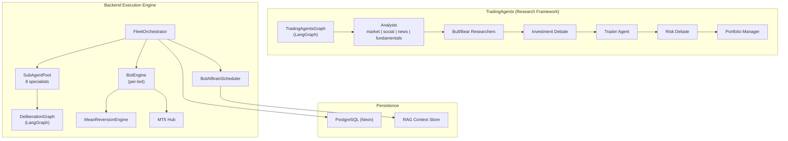
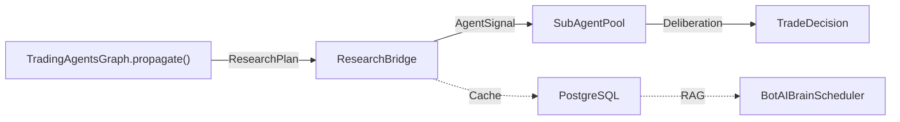

# MetaClaw Symbol Trader — Architecture Review & Improvement Proposals

> **Scope:** Full-stack analysis of the TradingAgents research framework, backend execution engine, multi-agent deliberation protocol, fleet orchestration, and data pipeline.
> **Date:** 2026-05-10

---

## Table of Contents

1. [System Architecture Overview](#1-system-architecture-overview)
2. [Critical: TradingAgents ↔ Backend Integration Gap](#2-critical-tradingagents--backend-integration-gap)
3. [New Agent Proposals](#3-new-agent-proposals)
4. [Deliberation Protocol Hardening](#4-deliberation-protocol-hardening)
5. [API & Data Pipeline Improvements](#5-api--data-pipeline-improvements)
6. [LLM Reliability & Cost Optimisation](#6-llm-reliability--cost-optimisation)
7. [Strategy Engine Modernisation](#7-strategy-engine-modernisation)
8. [Observability & DevOps](#8-observability--devops)
9. [Market Data Aggregator Enhancements](#9-market-data-aggregator-enhancements)
10. [Implementation Roadmap](#10-implementation-roadmap)

---

## 1. System Architecture Overview



### Current State Summary

| Layer | Tech | Status |
|---|---|---|
| **Research** | TradingAgents (LangGraph + LangChain) | ✅ Functional, standalone |
| **Execution** | Backend (FastAPI + MT5) | ✅ Production |
| **Deliberation** | SubAgentPool + DeliberationGraph | ✅ Active, 8 agents |
| **AI Evolution** | BotAIBrainScheduler | ✅ Gemini/Ollama dual-path |
| **Persistence** | PostgreSQL (Neon) | ✅ Migrated from Firestore |
| **Integration** | TradingAgents ↔ Backend | ⚠️ **Not connected** |

---

## 2. Critical: TradingAgents ↔ Backend Integration Gap

> [!IMPORTANT]
> The TradingAgents research framework and the backend execution engine are **two separate systems with no runtime bridge**. This is the single largest architectural gap.

### Current Disconnection

The **TradingAgents** framework ([trading_graph.py](file:///Users/ikymasie/Documents/Work/Projects/MetaClaw-Symbol-Trader/TradingAgents-main/tradingagents/graph/trading_graph.py)) produces rich research artifacts:
- Multi-analyst reports (market, social, news, fundamentals)
- Adversarial bull/bear debate transcripts
- Risk-assessed portfolio recommendations (`ResearchPlan` schema)

The **backend** ([sub_agents.py](file:///Users/ikymasie/Documents/Work/Projects/MetaClaw-Symbol-Trader/backend/sub_agents.py)) has its own parallel agent system that:
- Runs 8 specialist agents (Watchman, Sentiment, Macro, Earnings, Technical, ICT, RiskManager, CRO)
- Produces `AgentSignal` / `AgentVote` / `TradeDecision` outputs
- Feeds into the `DeliberationGraph` for quorum-based decisions

**These two systems never communicate.**

### Proposed Integration Architecture



#### 2.1 — ResearchBridge Adapter (P0)

Create a bridge module that translates `TradingAgentsGraph` output into `AgentSignal` format:

```python
# backend/research_bridge.py (proposed)
class ResearchBridge:
    """Adapts TradingAgents ResearchPlan → backend AgentSignal."""
    
    def translate(self, plan: ResearchPlan) -> AgentSignal:
        rating_map = {
            "Buy": 0.8, "Overweight": 0.4, "Hold": 0.0,
            "Underweight": -0.4, "Sell": -0.8,
        }
        return AgentSignal(
            agent="research_framework",
            sentiment=rating_map.get(plan.recommendation.value, 0.0),
            confidence=0.85,  # High: full debate pipeline
            reasoning=plan.rationale[:200],
        )
```

#### 2.2 — Scheduled Research Cycles (P1)

Wire `TradingAgentsGraph.propagate()` into the fleet monitor loop on a configurable schedule (e.g., every 4 hours):

- Run asynchronously via `asyncio.to_thread()` (TradingAgents is synchronous)
- Cache results in PostgreSQL with TTL
- Inject cached `AgentSignal` into `SubAgentPool.latest_signals` under key `"research_framework"`
- Add `"research_framework"` as a panel voter in `deliberate()` with weight `2.0`

#### 2.3 — Symbol Normalisation Layer (P0)

The TradingAgents framework uses Yahoo Finance tickers (`AAPL`, `MSFT`), while the backend uses MT5 broker symbols with suffixes (`AAPL_i`, `EURUSD_i`). Create a bidirectional mapper:

```python
# backend/symbol_mapper.py (proposed)
class SymbolMapper:
    def to_research(self, mt5_symbol: str) -> str:
        """EURUSD_i → EURUSD=X (YFinance forex convention)"""
    def to_execution(self, research_symbol: str) -> str:
        """AAPL → AAPL_i (broker suffix)"""
```

> [!WARNING]
> The existing `symbol_service.py` handles suffix logic but has had repeated bugs with case sensitivity (see conversation `b261edcc`). The mapper must be the **single source of truth** for all symbol translation.

---

## 3. New Agent Proposals

### Current Agent Roster

| Agent | Type | LLM? | Role |
|---|---|---|---|
| WatchmanAgent | Gate | Yes | Real-time price action veto |
| SentimentAgent | Panel | Yes | Social/news sentiment |
| MacroAgent | Panel | Yes | Macro regime (RISK_ON/OFF) |
| EarningsAgent | Panel | Yes | Earnings calendar proximity |
| TechnicalAgent | Panel | Yes | Technical indicator analysis |
| ICTAgent | Panel | No | Smart money concepts (pure math) |
| RiskManagerAgent | Gate | No | Kelly Criterion sizing + drawdown |
| CROAgent | Gate | Yes | Adversarial veto review |

### 3.1 — CorrelationAgent (P1)

**Purpose:** Detect inter-asset correlation shifts that invalidate mean-reversion assumptions.

- **Input:** 1h bars for the traded symbol + 3–5 correlated assets (e.g., EURUSD ↔ DXY, GBP, gold)
- **Logic:** Rolling 20-period Pearson correlation; flag when correlation breaks below 2σ from historical mean
- **Output:** `AgentSignal` with `sentiment` reflecting correlation health
- **LLM:** No (pure statistics)
- **Weight:** `1.25` (higher than Technical because correlation breakdown is a regime signal)

### 3.2 — OrderFlowAgent (P2)

**Purpose:** Analyse volume profile and order flow imbalance from MT5 tick data.

- **Input:** Last 500 ticks from MT5 via `mt5_hub`
- **Logic:** Delta (buy volume − sell volume), cumulative delta divergence, volume-weighted price levels
- **Output:** Signal indicating institutional accumulation/distribution
- **LLM:** No
- **Weight:** `1.5`

### 3.3 — VolatilityRegimeAgent (P1)

**Purpose:** Replace the current inline `RegimeDetector` with a dedicated agent that participates in deliberation.

Currently, regime detection in [strategy.py L441](file:///Users/ikymasie/Documents/Work/Projects/MetaClaw-Symbol-Trader/backend/strategy.py#L441) gates entries silently. Making it a voting agent allows the quorum to weigh regime context alongside other signals.

- **Input:** ATR z-score, ADX, Bollinger Band width
- **Logic:** Classify RANGING / TRENDING / VOLATILE with confidence
- **LLM:** No
- **Weight:** `1.0`

### 3.4 — CalendarAgent (P2)

**Purpose:** Economic calendar awareness (NFP, FOMC, CPI releases).

- **Input:** Economic calendar API (e.g., ForexFactory, Investing.com)
- **Logic:** VETO all entries within ±30min of high-impact events; reduce confidence ±2h
- **LLM:** No
- **Weight:** N/A (veto-only)

### 3.5 — Cross-Timeframe TrendAgent (P1)

**Purpose:** Formalise the multi-timeframe trend data that currently flows through `market_trends` dict as a proper voting agent.

Currently, trend summaries are computed in `MarketDataAggregator` and passed to agents via `update_market_trends()`, but no agent actually **votes** on timeframe alignment. This agent would:

- Read 1m, 15m, 1h, 1d trend summaries
- Vote `BUY` only when ≥3/4 timeframes agree on direction
- Apply a confidence discount when timeframes conflict

---

## 4. Deliberation Protocol Hardening

### 4.1 — Quorum Threshold Inconsistency (P0, Bug)

In [sub_agents.py L1755-1762](file:///Users/ikymasie/Documents/Work/Projects/MetaClaw-Symbol-Trader/backend/sub_agents.py#L1755):

```python
quorum_met = weighted_score >= 0.25  # Line 1755
# ...
if not quorum_met or weighted_score < 0.2:  # Line 1762 — contradicts!
```

The `0.2` check on L1762 is redundant and confusing (if `weighted_score >= 0.25`, it's always `>= 0.2`). But if the intent was a softer fallback, it should be documented. **Recommendation:** Remove the `weighted_score < 0.2` clause.

### 4.2 — Darwinian Weight Staleness (P1)

`DarwinianWeightStore.daily_update()` runs every 24h ([fleet.py L617](file:///Users/ikymasie/Documents/Work/Projects/MetaClaw-Symbol-Trader/backend/fleet.py#L617)), but weight deltas only use recent trade outcomes. If a bot has 0 trades in a 24h window, weights stagnate.

**Proposal:** Add an exponential decay factor that regresses weights toward `1.0` during inactive periods:

```python
# In daily_update(), after normal adjustment:
DECAY_RATE = 0.02
for agent in self._weights:
    self._weights[agent] = self._weights[agent] * (1 - DECAY_RATE) + 1.0 * DECAY_RATE
```

### 4.3 — LangGraph Deliberation Timeout Hardening (P1)

In [sub_agents.py L1433](file:///Users/ikymasie/Documents/Work/Projects/MetaClaw-Symbol-Trader/backend/sub_agents.py#L1433):

```python
_decision = _fut.result(timeout=120)  # 2 minutes — too generous
```

If 4+ LLM agents each take 30s (Ollama on CPU), the 120s timeout is easily hit. **Proposals:**
- Reduce per-agent timeout to 45s in the LangGraph node wrappers
- Add a circuit breaker: if 2 consecutive deliberations timeout, disable LangGraph path for 1 hour
- Surface timeout metrics to the Situation Room UI

### 4.4 — Vote Cache TTL Race Condition (P1)

The `vote_cache_ttl` parameter (default 1800s) controls when cached LLM votes are refreshed. But `_vote_timestamps` is accessed outside the lock:

```python
age = time.time() - self._vote_timestamps.get(agent_name, 0)  # L1560 — no lock!
```

While `dict.get()` is thread-safe in CPython due to the GIL, this is fragile. Wrap in `self._lock`.

---

## 5. API & Data Pipeline Improvements

### 5.1 — Vendor Failover Improvements (P1)

The [interface.py](file:///Users/ikymasie/Documents/Work/Projects/MetaClaw-Symbol-Trader/TradingAgents-main/tradingagents/dataflows/interface.py) `route_to_vendor()` only falls back on `AlphaVantageRateLimitError`. Other exceptions (network timeouts, API changes) are not caught and will crash the calling agent.

**Fix:** Catch `(ConnectionError, TimeoutError, requests.RequestException)` in addition to rate limit errors. Log the failure and continue to the next vendor.

### 5.2 — MT5 Data as a Third Vendor (P2)

The TradingAgents framework currently uses only YFinance and Alpha Vantage. Since the backend already has live MT5 data flowing through `mt5_hub`, register MT5 as a data vendor:

```python
# In VENDOR_METHODS:
"get_stock_data": {
    "mt5": get_mt5_bars,       # New
    "yfinance": get_YFin_data_online,
    "alpha_vantage": get_alpha_vantage_stock,
},
```

This gives research agents access to the **exact same data** the execution engine is trading on, eliminating data source divergence.

### 5.3 — REST API Gaps (P1)

Missing endpoints that the frontend Situation Room needs:

| Endpoint | Purpose |
|---|---|
| `GET /fleet/bot/{id}/deliberation/history` | Historical deliberation audit trail |
| `GET /fleet/bot/{id}/agents/weights` | Current Darwinian weights |
| `PUT /fleet/bot/{id}/agents/weights` | Manual weight override (operator) |
| `GET /fleet/bot/{id}/research` | Latest TradingAgents research report |
| `POST /fleet/bot/{id}/research/trigger` | On-demand research cycle |
| `GET /fleet/metrics/system` | CPU, RAM, event loop latency history |

### 5.4 — WebSocket Event Schema (P1)

The DeliberationGraph pushes events to `_event_queue` but the event format is ad-hoc. Standardise:

```python
@dataclass
class DeliberationEvent:
    event_type: Literal["agent_start", "agent_done", "veto", "quorum", "decision"]
    agent: str
    timestamp: str
    payload: dict  # vote, reasoning, confidence, etc.
```

---

## 6. LLM Reliability & Cost Optimisation

### 6.1 — Gemini Budget Monitor Enhancement (P0)

The current `gemini_budget` is a simple counter. Enhance with:

- **Sliding window:** Track calls per rolling 60s window, not just daily total
- **Cost estimation:** Map model → cost-per-1K-tokens; surface estimated daily spend
- **Auto-downgrade:** When budget is at 80%, switch from `gemini-2.0-flash` to `gemini-2.0-flash-lite` instead of falling to Ollama

### 6.2 — Structured Output for Sub-Agents (P1)

Backend sub-agents ([sub_agents.py](file:///Users/ikymasie/Documents/Work/Projects/MetaClaw-Symbol-Trader/backend/sub_agents.py)) use free-text LLM prompts and parse JSON from the response. The TradingAgents framework already has Pydantic schemas ([schemas.py](file:///Users/ikymasie/Documents/Work/Projects/MetaClaw-Symbol-Trader/TradingAgents-main/tradingagents/agents/schemas.py)).

**Proposal:** Use `response_format={"type": "json_object"}` (already used in AI Brain) for all sub-agent LLM calls. Define a shared `AgentVoteSchema`.

> [!IMPORTANT]
> **Model Selection:** When implementing structured outputs, use `gemini-3.1-flash` or `gemini-3.1-flash-lite` as primary models to ensure high-fidelity JSON parsing and low latency.

### 6.3 — LLM Response Caching (P2)

Many sub-agent calls are near-identical within a 30-minute window (same symbol, same market data). Implement a content-addressable cache:

- Hash: `sha256(agent_name + symbol + prompt_hash)`
- TTL: Match `vote_cache_ttl` (30 min default)
- Storage: In-memory LRU with PostgreSQL overflow

### 6.4 — Ollama Model Pool (P2)

Currently, all agents fall back to the same Ollama model (`gemma4:e4b`). Different agents have different complexity needs:

| Agent | Recommended Ollama Model | Reason |
|---|---|---|
| WatchmanAgent | `gemma4:e4b` | Simple price action |
| MacroAgent | `gemma4:e12b` | Complex macro reasoning |
| CROAgent | `gemma4:e12b` | Adversarial analysis |
| SentimentAgent | `gemma4:e4b` | Text classification |

---

## 7. Strategy Engine Modernisation

### 7.1 — Strategy Plugin Architecture (P1)

The current `MeanReversionEngine` is the only strategy, hardcoded in [strategy.py](file:///Users/ikymasie/Documents/Work/Projects/MetaClaw-Symbol-Trader/backend/strategy.py). The `BotConfig.strategy` field exists but isn't used for routing.

**Proposal:** Abstract strategy interface:

```python
class BaseStrategy(ABC):
    @abstractmethod
    def generate_signal(self, df: pd.DataFrame, config: dict) -> SignalType: ...
    
    @abstractmethod
    def get_state_snapshot(self) -> dict: ...

class MeanReversionStrategy(BaseStrategy): ...
class MomentumStrategy(BaseStrategy): ...
class ICTStrategy(BaseStrategy): ...
```

Then in `BotEngine.__init__()`:

```python
STRATEGY_REGISTRY = {
    "mean_reversion": MeanReversionStrategy,
    "momentum": MomentumStrategy,
    "ict_smart_money": ICTStrategy,
}
self.strategy = STRATEGY_REGISTRY[config.strategy]()
```

### 7.2 — Duplicate Drawdown Logic (P0, Cleanup)

Three separate systems check drawdown:
1. `strategy.py` L676 — 6% legacy check
2. `VitalSigns` — 10% ORGAN_FAILURE, 15% PROTOCOL_FINAL
3. `FleetOrchestrator.enforce_global_risk_limits()` — fleet-wide

The legacy 6% check in strategy.py should be removed in favour of VitalSigns, which is more sophisticated. Currently, if `max_daily_drawdown_pct` is set to 8%, VitalSigns won't trigger until 10%, creating a gap where neither system acts.

**Fix:** Remove the inline drawdown check from `_run_live_loop()` and configure VitalSigns thresholds from `BotConfig.max_daily_drawdown_pct`.

### 7.3 — Event Loop per Bot (P2)

Currently, all bots share a single asyncio event loop captured in `FleetOrchestrator._main_loop`. Coroutine scheduling via `run_coroutine_threadsafe()` creates contention. If one bot's PostgreSQL write blocks (429 from Neon), it delays all bots' coroutines.

**Proposal:** Give each `BotInstance` its own asyncio event loop running in a dedicated thread, isolating failure domains.

---

## 8. Observability & DevOps

### 8.1 — Structured Logging (P1)

Replace the current `logging.getLogger()` string formatting with structured JSON logs:

```python
logger.info("deliberation_complete", extra={
    "bot_id": self.bot_id,
    "signal": raw_signal,
    "quorum_score": weighted_score,
    "approved": decision.approved,
    "latency_ms": elapsed_ms,
})
```

This enables log aggregation, alerting on `quorum_score < 0.3`, and performance dashboards.

### 8.2 — Agent Performance Dashboard (P1)

Surface the following metrics per agent:

| Metric | Source |
|---|---|
| Avg response time (ms) | Timer around `agent.run()` |
| LLM fallback rate | Count Gemini vs Ollama calls |
| Vote accuracy (30d rolling) | Compare vote direction vs actual trade P&L |
| Veto rate | Count VETO / total votes |
| Darwinian weight trend | `DarwinianWeightStore` history |

### 8.3 — Health Check Endpoint (P0)

Add `GET /health` that returns:

```json
{
  "status": "healthy",
  "mt5_connected": true,
  "postgres_connected": true,
  "gemini_budget_remaining_pct": 45,
  "ollama_reachable": true,
  "active_bots": 3,
  "uptime_seconds": 86400
}
```

### 8.4 — Graceful Shutdown (P1)

The current shutdown path doesn't guarantee:
- All pending PostgreSQL writes are flushed
- All open MT5 positions are documented
- Sub-agent ThreadPoolExecutors are properly drained

Add a `SIGTERM` handler that calls `fleet.stop_monitor()` → drains DB queues → saves final telemetry.

---

## 9. Market Data Aggregator Enhancements

### 9.1 — Direct DataFrame Injection (P1)

Currently, `MarketDataAggregator.process_symbol` converts lists of dicts to DataFrames, computes indicators, and then converts back to dicts for the `market_trends` summary. Agents then often have to convert these dicts back to DataFrames if they want to do further technical analysis.

**Proposal:**
- Update `BaseAgent` to support a `dataframes` attribute.
- Allow `MarketDataAggregator` to pass the raw computed DataFrames for each timeframe directly to the agents.
- This eliminates redundant CPU cycles spent on serialization/deserialization.

### 9.2 — Aggregator Caching & Delta Processing (P1)

If a bot is polling every 30 seconds but the 1m bar hasn't closed, `MarketDataAggregator` re-aggregates the entire historical window.

**Proposal:**
- Implement a `LastAggregatedTimestamp` cache per symbol/timeframe.
- Only re-aggregate if a new bar has arrived or the current "open" bar has significant price movement.

### 9.3 — Dynamic Regime Thresholds (P2)

The `RegimeDetector` uses hardcoded thresholds (ADX=25, ATR_z=2.0). These should be part of the `DarwinianWeightStore` ecosystem.

**Proposal:**
- Allow the `DarwinianWeightStore` to track not just agent weights, but also optimal regime parameters.
- If mean-reversion trades are losing in a "RANGING" market with ADX 23, the system should consider lowering the trend threshold to 20 to be more conservative.

---

## 10. Implementation Roadmap

### Phase 1 — Foundations (Week 1–2)

| # | Task | Priority | Effort | Status |
|---|---|---|---|---|
| 1 | Fix quorum threshold inconsistency (§4.1) | P0 | 0.5h | ✅ Done |
| 2 | Remove duplicate drawdown logic (§7.2) | P0 | 2h | ✅ Done |
| 3 | Enhance health check endpoint (§8.3) | P0 | 1h | ✅ Done |
| 4 | Symbol normalisation layer (§2.3) | P0 | 4h | ✅ Done |
| 5 | Vendor failover fix (§5.1) | P1 | 1h | ✅ Done |
| 6 | Vote cache lock fix (§4.4) | P1 | 0.5h | ✅ Done |
| 6a| **Detailed Codebase Analysis (Phase 1)** | P0 | 4h | ✅ Done |

### Phase 2 — Integration (Week 3–4)

| # | Task | Priority | Effort | Status |
|---|---|---|---|---|
| 7 | ResearchBridge adapter (§2.1) | P0 | 8h | ✅ Done |
| 8 | Scheduled research cycles (§2.2) | P1 | 6h | ✅ Done |
| 9 | VolatilityRegimeAgent (§3.3) | P1 | 4h | ✅ Done |
| 10 | Cross-Timeframe TrendAgent (§3.5) | P1 | 4h | ✅ Done |
| 11 | Structured output for sub-agents (§6.2) | P1 | 4h | ✅ Done |

### Phase 3 — Polish (Week 5–6)

| # | Task | Priority | Effort | Status |
|---|---|---|---|---|
| 12 | CorrelationAgent (§3.1) | P1 | 6h | ✅ Done |
| 13 | Strategy plugin architecture (§7.1) | P1 | 8h | ✅ Done |
| 14 | Gemini budget enhancement (§6.1) | P0 | 4h | ✅ Done |
| 15 | REST API gaps (§5.3) | P1 | 6h | ✅ Done |
| 16 | Structured logging (§8.1) | P1 | 4h | ✅ Done |
| 17 | Darwinian weight decay (§4.2) | P1 | 2h | ✅ Done |
| 17a| Market Data Aggregator Enhancements (§9.x) | P1 | 6h | ✅ Done |

### Phase 4 — Advanced (Week 7+)

| # | Task | Priority | Effort | Status |
|---|---|---|---|---|
| 18 | OrderFlowAgent (§3.2) | P2 | 8h | ✅ Done |
| 19 | CalendarAgent (§3.4) | P2 | 6h | ✅ Done |
| 20 | MT5 as data vendor (§5.2) | P2 | 6h | ✅ Done |
| 21 | LLM response caching (§6.3) | P2 | 4h | ✅ Done |
| 22 | Ollama model pool (§6.4) | P2 | 3h | ✅ Done |
| 23 | Per-bot event loop (§7.3) | P2 | 8h | ✅ Done |
| 24 | Graceful shutdown (§8.4) | P1 | 3h | ✅ Done |

---

> [!TIP]
> **Quick Wins (< 2h each):** Items 1, 3, 5, 6 can be done immediately and fix real bugs or add critical missing infrastructure. Start here.

> [!CAUTION]
> **Highest Risk:** The ResearchBridge (§2.1) is the most architecturally significant change. It introduces a new dependency chain (TradingAgents → SubAgentPool) and requires careful error isolation so a research framework crash doesn't block live trading deliberation.
